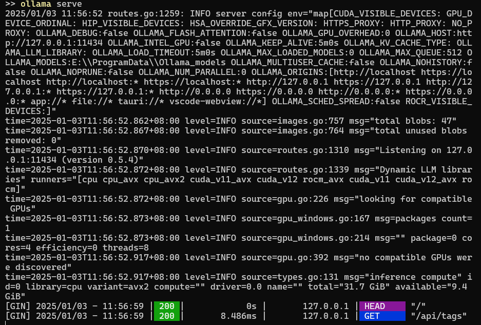
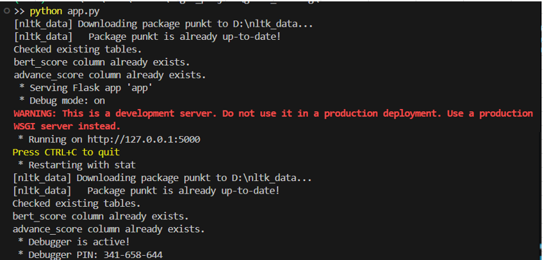

# Full stack Web App Using Nextjs and Flask (mysql db and Ollama llama3.2)
- The MySQL database needs to be installed and running before running the application.

## Prerequisites
- **MySQL Setup**: Ensure that MySQL is installed and a database is created for this application. For a detailed guide on installing and setting up MySQL, refer to the [official MySQL documentation](https://dev.mysql.com/doc/mysql-installation-excerpt/8.0/en/). Additionally, ensure that a database is created specifically for this application. You can use the following SQL command to create a database:
```sql
CREATE DATABASE genai_tests;
```

## A. Using Ollama with Llama 3.2

This guide provides step-by-step instructions to set up and use the Ollama CLI with the Llama 3.2 model.
### Prerequisites

- Ensure your system meets the requirements to run Ollama CLI.
- A stable internet connection is required to download the model.

### Step 1: Install Ollama
Follow these steps to install the Ollama CLI:

1. Visit the official Ollama website: [https://ollama.com](https://ollama.com)
2. Download the appropriate installer for your operating system.
3. Follow the installation instructions provided for your OS.

Alternatively, install Ollama via a package manager (if supported).

### Step 2: Verify Installation
Once installed, verify that Ollama is set up correctly by checking the version:

```bash
ollama --version
```

If the version is displayed, Ollama is successfully installed.

### Step 3: Pull the Llama 3.2 Model
Before you can use Llama 3.2, download the model by running:

```bash
ollama pull llama3.2
```

This will fetch the Llama 3.2 model to your local system.

### Step 4: Start the Ollama Server
To interact with the model, start the Ollama server:

```bash
ollama serve
```
- ollama server console:

The server must be running for queries to work.

### Troubleshooting
- If the `ollama` command is not recognized, ensure the CLI is installed and added to your system's PATH.
- Ensure the Ollama server is running (`ollama serve`) before sending queries.

- For further assistance, visit the [Ollama Documentation](https://ollama.com/docs).
---

## B. Setup Back End - using Flask 

### Steps to Create and Activate a Virtual Environment

1. **Navigate to the `backend` Directory**  
   ```bash
   cd backend
   ```

2. **Create the Virtual Environment**  
   ```bash
   python -m venv venv
   ```

3. **Activate the Virtual Environment**  
   - On **Windows**:  
     ```bash
     venv\Scripts\activate
     ```

4. **Run pip command to install packages**
    - This will take some time to finish
   ```bash
   pip install -r requirements.txt
   ```

### Running Your Python Application

5. **Run the Python Application**  
   ```bash
   python app.py
   ```
- backend console:


6. **To exit the environment**  
   ```bash
   deactivate
   ```

## C. Setting Up FrontEnd - Using Next.js
### 1. Ensure Prerequisites

- **Install Node.js**: Ensure you have the latest stable version of Node.js installed. You can download it from [Node.js](https://nodejs.org).
- **Install npm or Yarn**: These package managers come with Node.js. Verify the installation:
  ```bash
  node -v
  npm -v
  ```

### 2. Navigate to Your Project

Move into the project directory:
```bash
cd frontend
```

### 3. Set Up Your Next.js Project

Use the following command to create a new Next.js app:

- Using **npm**:
  ```bash
  npm install
  ```
Replace `my-next-app` with your desired project name.

### 4. Start the Development Server

Run the development server:

- Using **npm**:
  ```bash
  npm run dev
  ```

- output:
   ```
   > frontend@0.1.0 dev
   > next dev --turbopack

      ▲ Next.js 15.0.3 (Turbopack)
      - Local:        http://localhost:3000

   ✓ Starting...
   ✓ Ready in 4.8s

   - By default, the server runs on [http://localhost:3000]
   ```

### 5. Open the browser and navigate to [http://localhost:3000](http://localhost:3000)
Landing Page:

